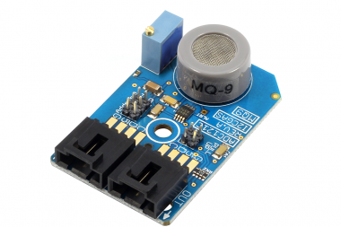

[](https://store.ncd.io/product/mq-9-carbon-monoxide-combustible-gas-sensor-adc121c-12-bit-adc-i2c-mini-module/).

# ADC121C_MQ9

The MQ-9 is capable of sensing carbon monoxide air concentration levels between 10 and 1,000ppm and combustible gas air concentration levels between 100 and 10,000ppm. The ideal sensing condition for the MQ9 is 20°C ±2°C at 65% ±5% humidity.
This Device is available from www.ncd.io

[SKU: ADC121C_MQ9_I2CS]

(https://store.ncd.io/product/mq-9-carbon-monoxide-combustible-gas-sensor-adc121c-12-bit-adc-i2c-mini-module/)
This Sample code can be used with Raspberry Pi.

Hardware needed to interface MQ9 carbon monoxide gas detection Sensor With Raspberry Pi : 

1. <a href="https://store.ncd.io/product/mq-9-carbon-monoxide-combustible-gas-sensor-adc121c-12-bit-adc-i2c-mini-module/">ADC121C_MQ9 carbon monoxide gas detection Sensor.</a>

2. <a href="https://store.ncd.io/product/i2c-shield-for-raspberry-pi-3-pi2-with-outward-facing-i2c-port-terminates-over-hdmi-port/">Raspberry Pi I2C Shield</a>

3. <a href="https://store.ncd.io/product/i%C2%B2c-cable/">I2C Cable</a>

## Python

Download and install smbus library on Raspberry pi. Steps to install smbus are provided at:

https://pypi.python.org/pypi/smbus-cffi/0.5.1

Download (or git pull) the code in pi. Run the program.

```cpp
$> python ADC121C_MQ9.py
```
The lib is a sample library, you will need to calibrate the sensor according to your application requirement.
